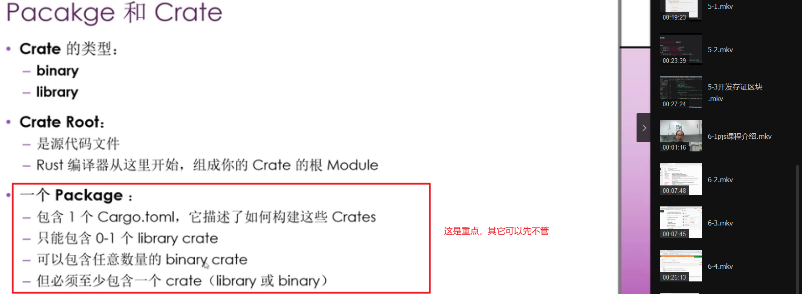
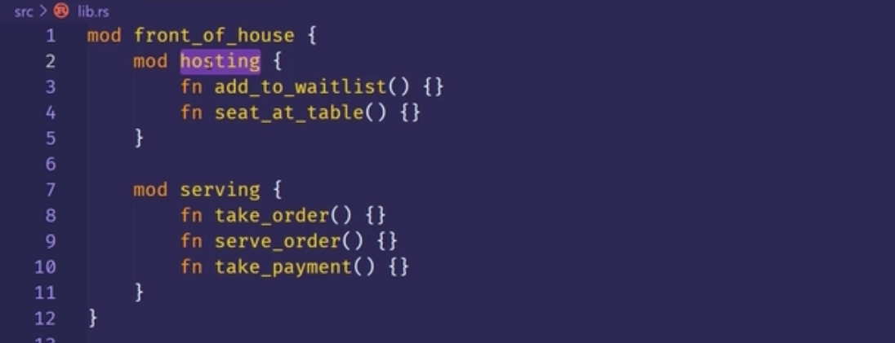

0000 rust的代码组织

0300 package和crate

0350 cargo惯例：src/main.rs 是binary crate的crate root。较复杂，看视频。

0547 定义module来控制作用域和私有性。较复杂，看视频。

----
以上图片显示不正常，就暂时去掉! ，让图片不显示。
### 更新内容
0140

越上方包含的范围越大

---

---

package名就是项目名

---

如果有 main.rs ，就说明有个binary crate，如果有lib.rs 就说明有个library crate。  
他俩都是入口文件，都是crate的根。而crate名和package，项目名相同。

---

---

---

***

整个模块树，都被放在名为crate的隐式跟模块下。
