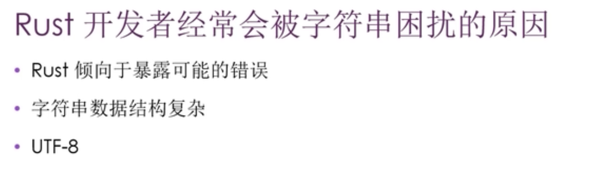
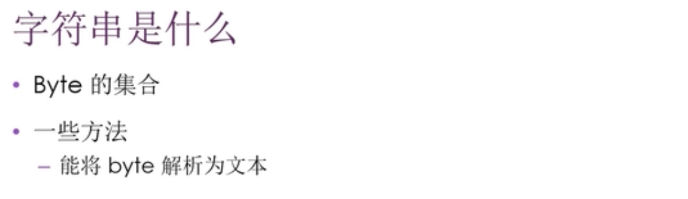
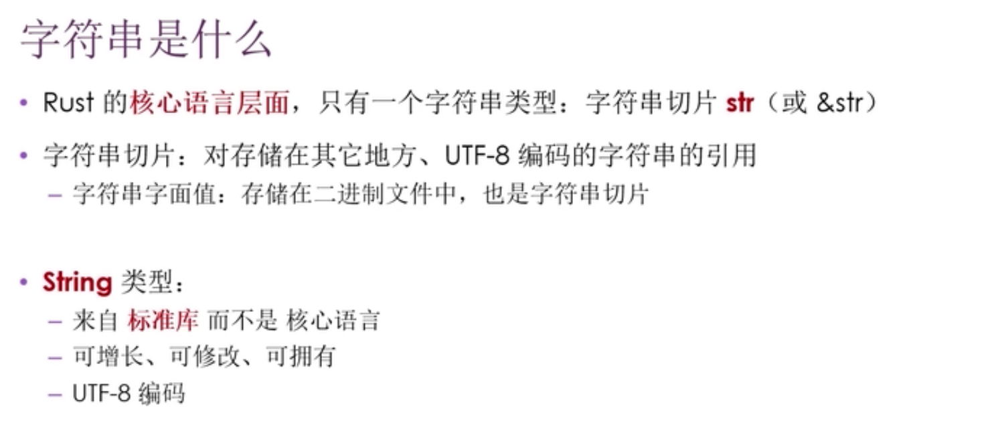
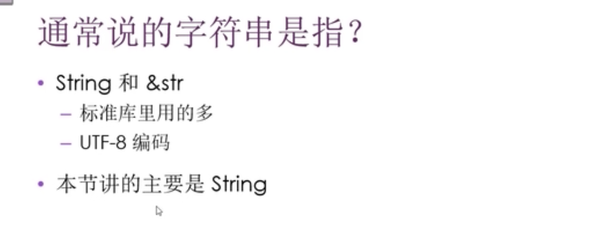

0000 string字符串的困扰

0039 字符串定义，基于byte字节的集合。以及一些方法能将字节解析为文本。  
0059 rust核心层面，只有一个字符串类型：字符串切片str(或&str)。具体看视频。重点。

0139 通常说字符串是指string和&str而不是其中的一种。

0200 其它类型的字符串

0240 创建一个新字符串  
0314 to_string() 方法，可用于实现了display trait的类型，包括字符串字面值。  
0350 string::from() 函数（注意前者是方法，这个是函数）

0451 更新string  
0642 +加号连接字符串，难点，看视频  
0936 format!连接多个字符串，这个更方便

------------------------
0030

.

.

.

通常说的字符串包括string和&str

0234

