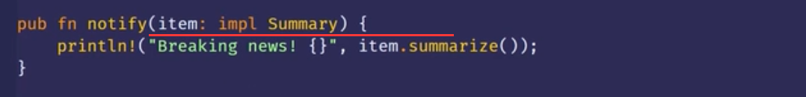
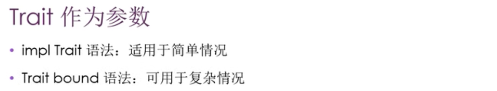
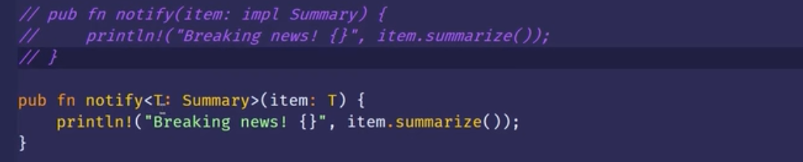
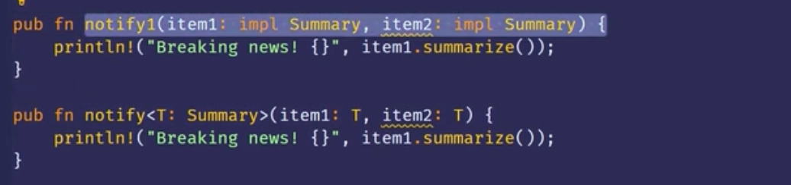
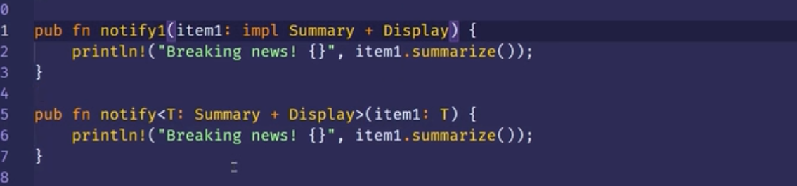
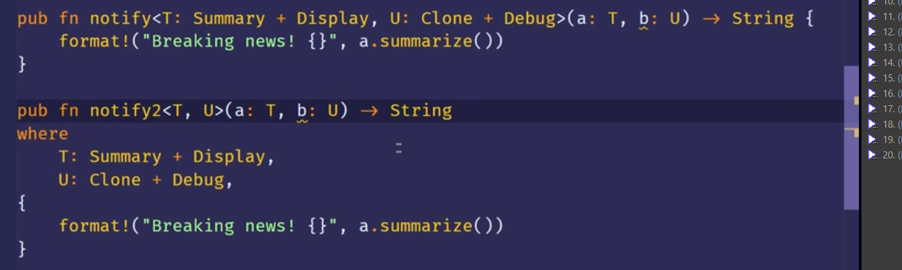
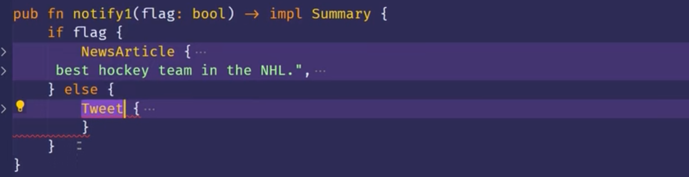
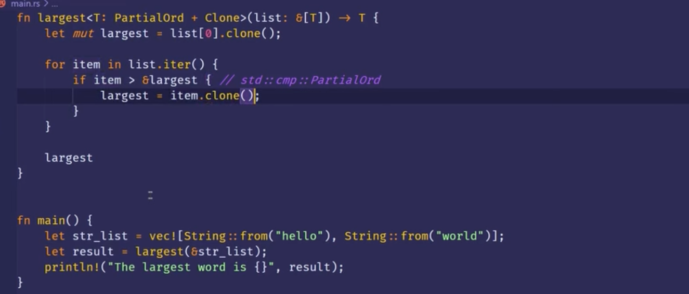
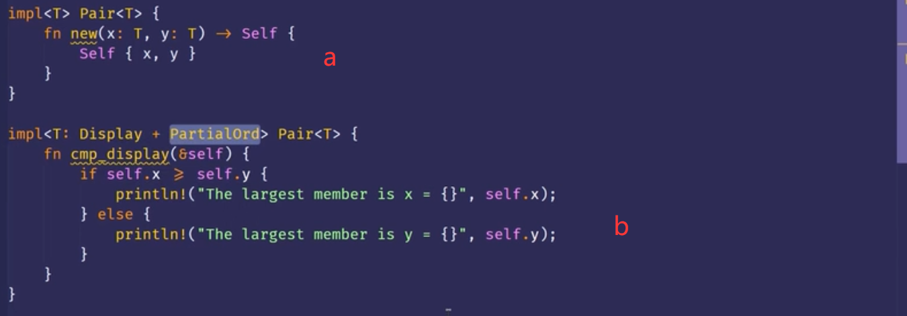
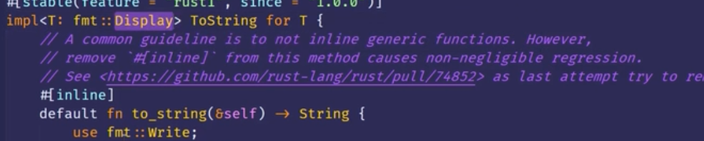

```
0000 trait作为参数

0450 实现trait作为返回类型->让函数或者方法的返回类型实现某个trait。

0628 使用trait bound的例子 ？？？重点，可复习
0645 >大于号这个运算符实际上是实现了std::cmp::PartialOrd这个trait。只有类型实现了这个trait才能用大于号来比较

1004 使用trait bound有条件的实现方法
*在使用泛型类型参数的impl块上使用Trait bound，我们可以有条件的为实现了特定Trait 的类型来实现方法（文字不好理解，看视频示例 ）
*也可以为实现了其它Trait的任意类型有条件的实现某个Trait
*为满足Trait Bound的所有类型.上实现Trait叫做覆盖实现( blanket implementations)  （看视频，例子：所有实现了display的都可以实现tostring）
```

***
new
***



第一图为简单写法，第三图为trait bound写法


这种情况trait bound写法就更简洁。 


多个trait时


where的形式。
***


尽管两者都实现了Summary，但rust仍不允许。只能返回一个固定的。0600e。
***

0629s 0945e zzzz 较复杂，看视频。涉及到很多trait知识。
***

zzzz  
a,无论t是什么类型，它都会有个new函数  
b，只有当t实现了display和partialord这两个trait后才能有cmp_display方法
***

要求给所有实现了display trait的类型全都实现tostring trait。这就是覆盖实现。