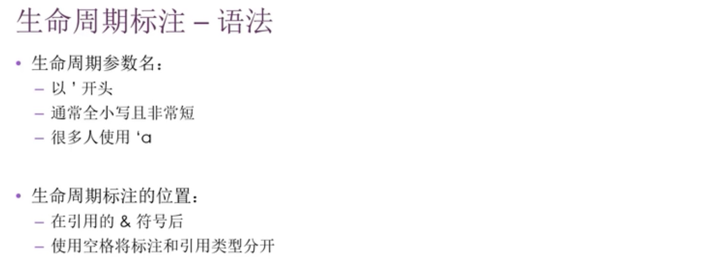
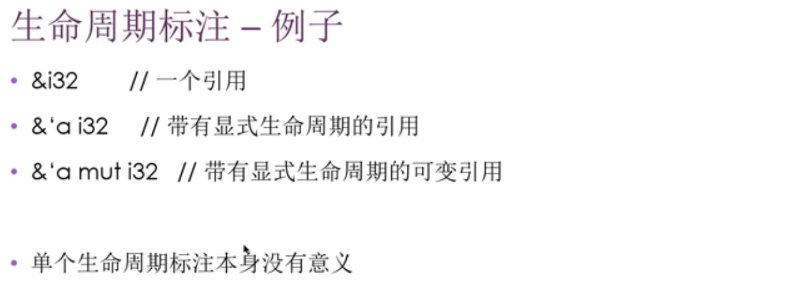
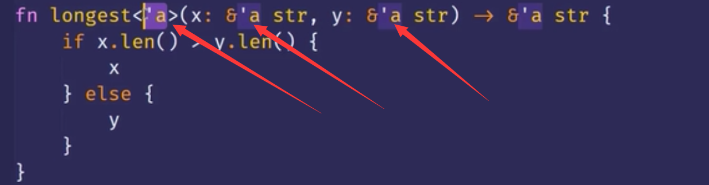
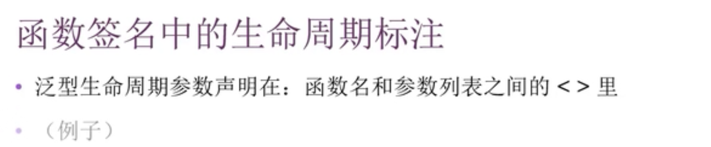
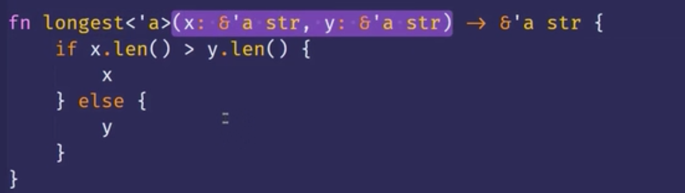
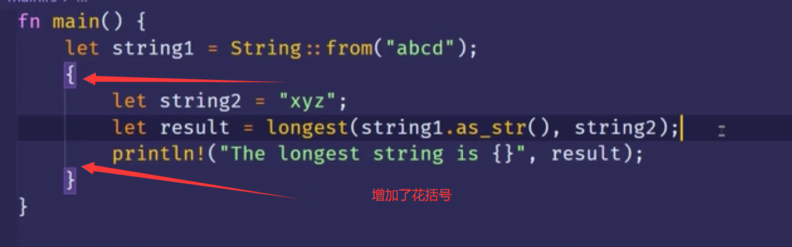
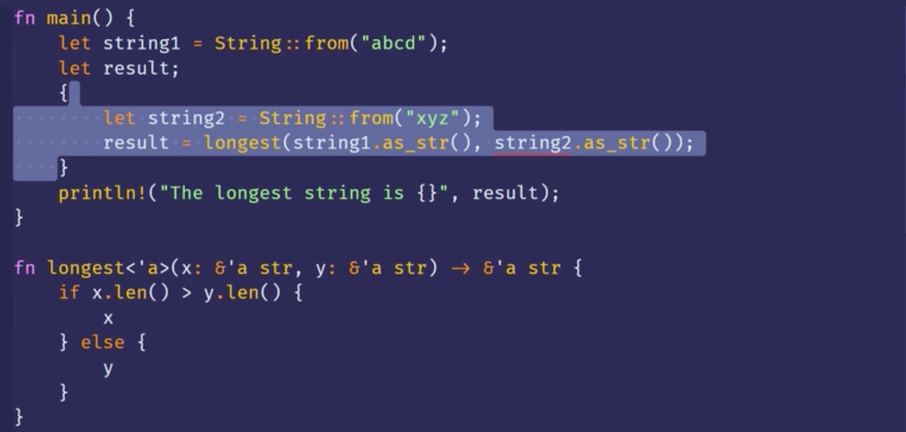

0000 生命周期标注  
生命周期的标注不会改变引用的生命周期长度  
当指定了泛型生命周期参数，函数可以接收带有任何生命周期的引用  
生命周期的标注:描述了多个引用的生命周期间的关系，但不影响生命周期 

0035 生命周期标注-语法  

0108 

0150

这代表x，y两个引用必须和这个泛型生命周期存活一样长的时间才行。（后面说明了，是不能短于'a）

0200

<'a>所表达的意思是参数和返回值这些引用，都必须拥有相同的生命周期（？？？也许不对），这个生命周期就是'a  
0241 这个函数签名的意思是，告诉rust有一个生命周期'a，函数有两个参数x，y，他俩都是字符串切片类型。这两个参数和返回的字符串切片的存活时间必须不短于'a这些约束就是我们想让rust保障的。  
0305 还有一点要注意，当在函数签名里面指明生命周期参数时并没有改变传入和返回值的生命周期。？？？剩下还有段没听懂。  
0326 所以这里longest函数本身并不需要指导x，y的存活时长。而只需要某个作用域可以用来代替'a，同时满足函数的签名约束即可。  
0333 事实上，如果函数引用它外部的代码或它被函数外部的代码引用时。想单靠rust本身来确定参数或者返回值的生命周期几乎是不可能的。而且函数所使用的生命周期可能在每次调用时都发生变化。所以才需要手动对生命周期标注。  
0354 当我们把具体的引用传入到longest函数的时候。被用来代替<'a>这个生命周期的作用域是x和y作用域重叠的那一部分。  
0406 换句话说，泛型周期'a所得到的具体的生命周期就是x，y中更短的那一个。？？？可能不对。

0426 

下边看一下，这个生命周期标注是如何对longest的调用进行限制的  
0448 string2比较特殊，是字符串字面值，是静态生命周期，在整个程序运行期间都存活。

0535

这样就会报错了，具体看视频。
