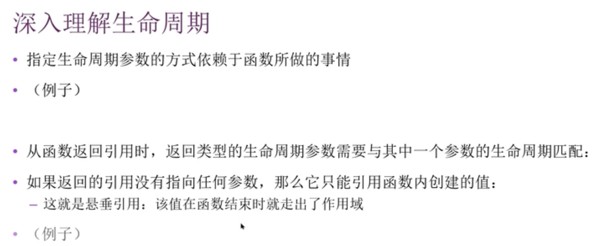
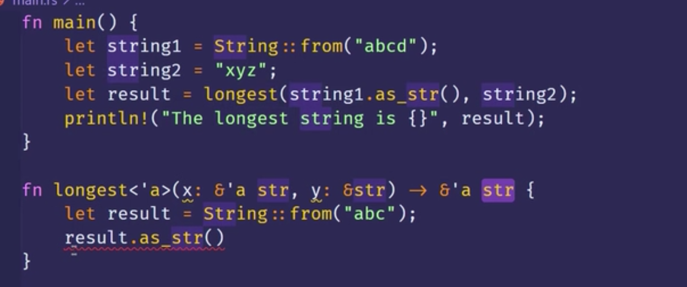
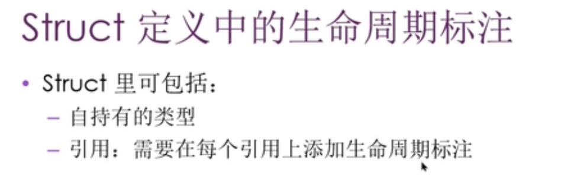
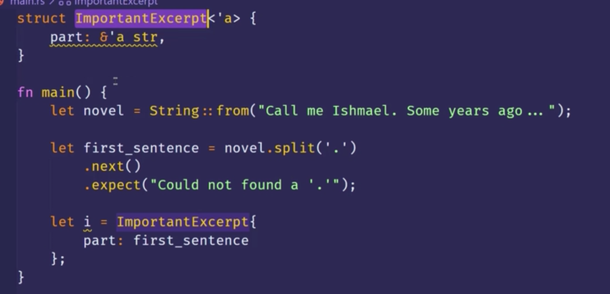
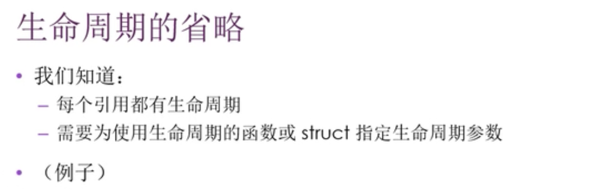
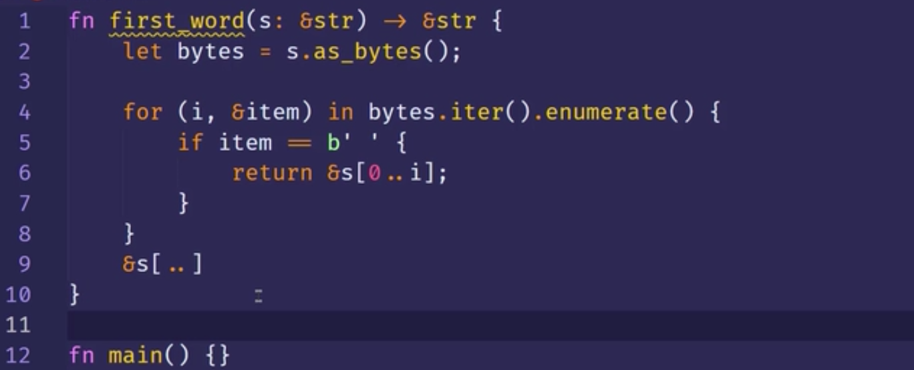
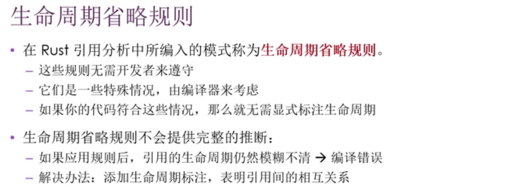
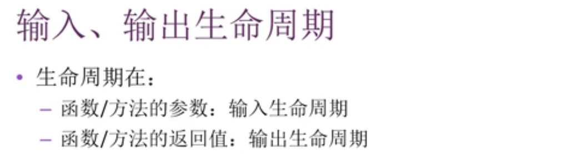
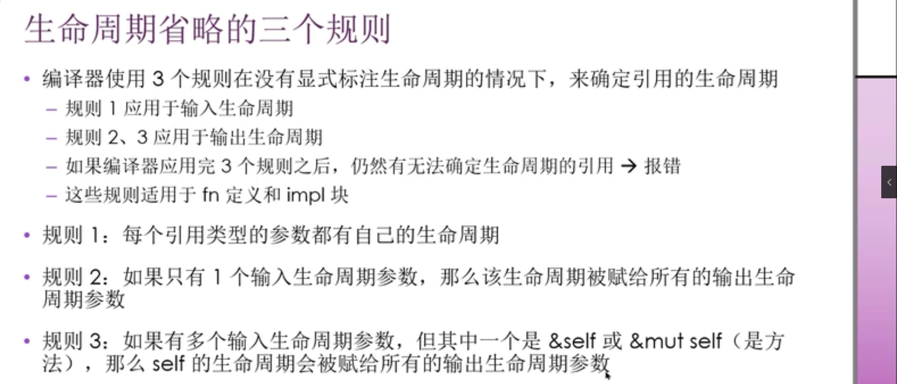

0000 

0130

例子：这会报错，因为产生了悬垂引用。

如果想把函数内部的值返回回去，就不返回引用，直接返回值。  
通过例子知道，生命周期这个语法，就是用来关联函数的不同参数以及返回值直接的生命周期的，一旦他们取得某种联系，rust就取得足够的信息来支持保证内存安全的操作，并且阻止那些可能导致悬垂指针或者其它违反内存安全的行为。

0241 Struct定义中的生命周期标注

part这个引用必须要比结构体实例存活得更长，因为只要实例存在，都会一直对part有引用。 ￥￥￥也许同样长也行？  

0355 生命周期的省略

这段代码虽没指明生命周期，但却可以正常编译  

0543 生命周期省略规则

0557 输入、输出生命周期

0606 生命周期省略的三个规则

0845 生命周期省略的三个规则-例子  
具体见视频