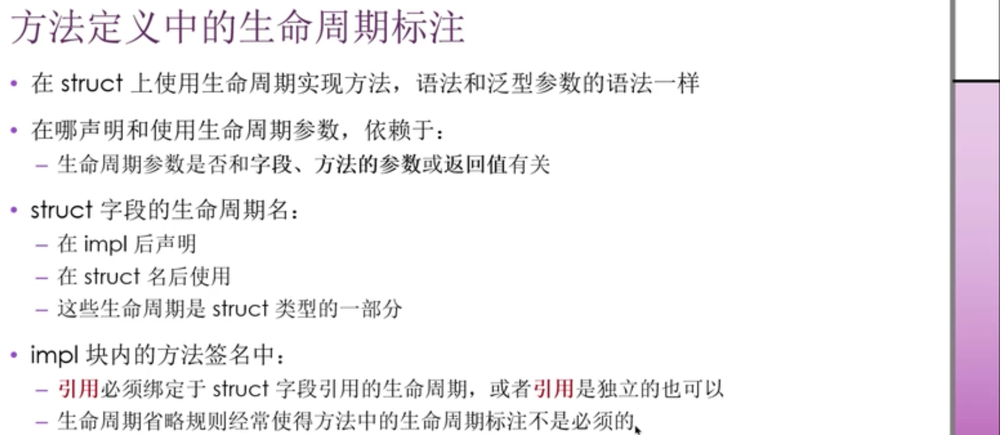
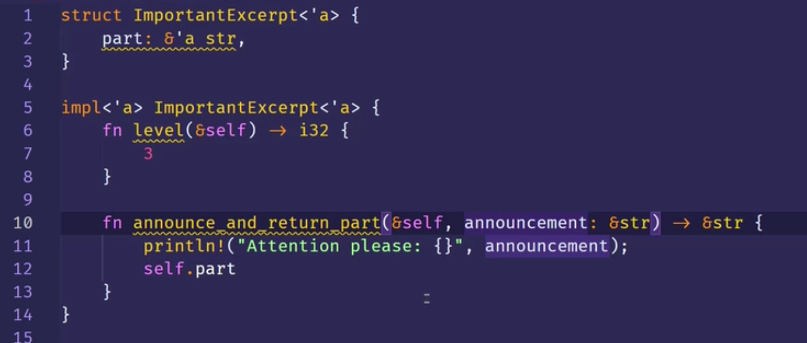
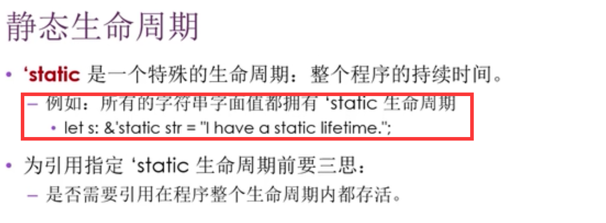
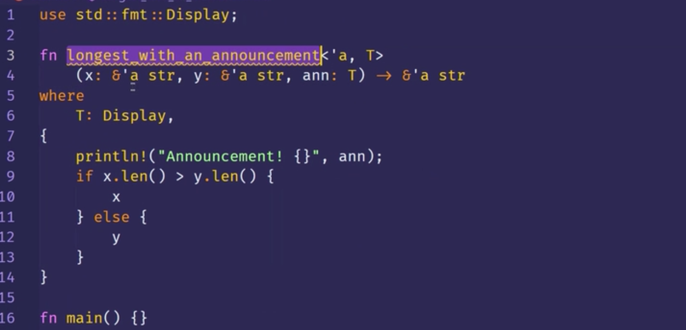

0000 方法定义中的生命周期标注

0209 

例子

0215 静态生命周期

0320 同时使用 泛型参数类型、Trait Bound、生命周期  （！！！重点）

这个函数的作用是返回 x，y 中比较长的那个。  
根据where的约束，T这个类型可以是任何实现了display trait的类型。在比较长度之前会把ann这个额外的参数打印出来。  
生命周期也是泛型的一种，所以'a T都放在了函数名后的<>里。  
