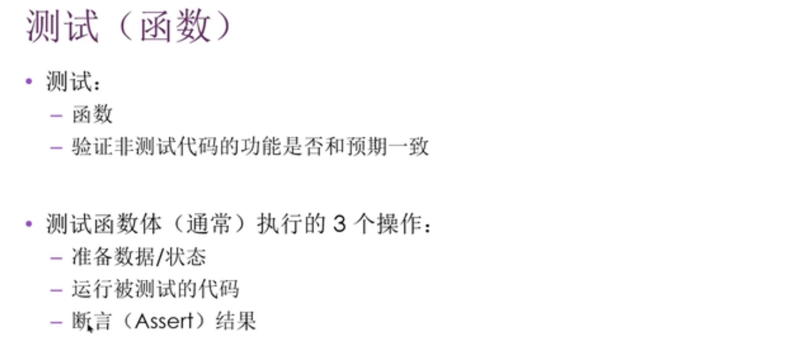
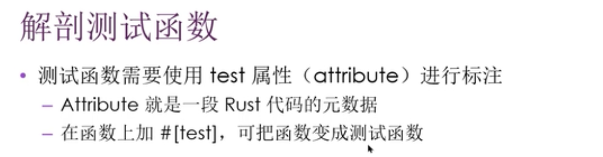
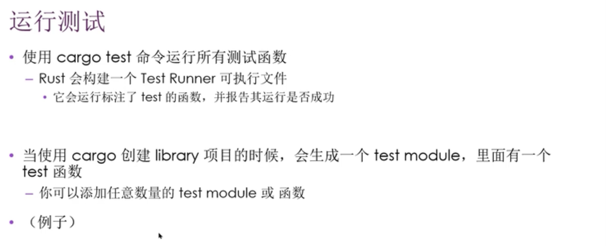
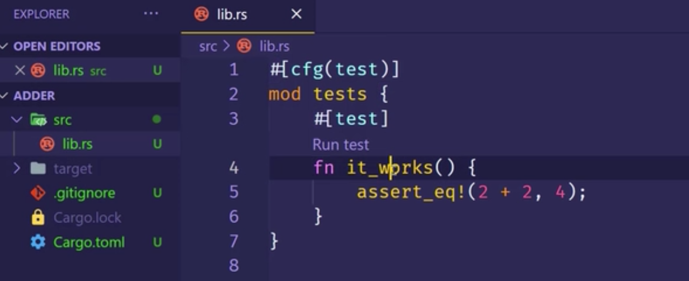
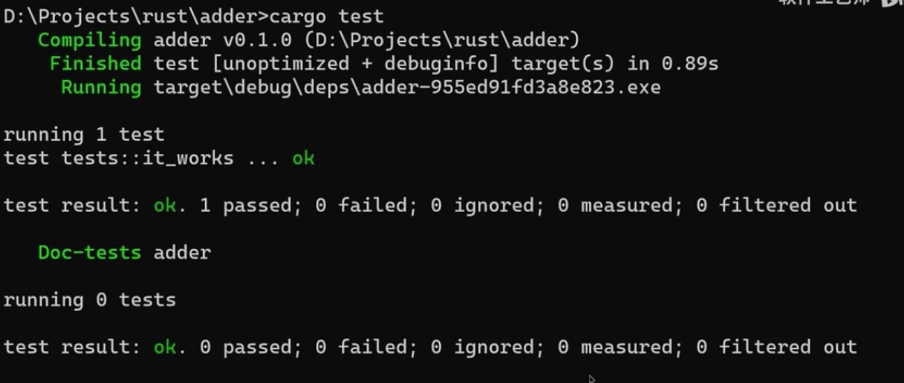
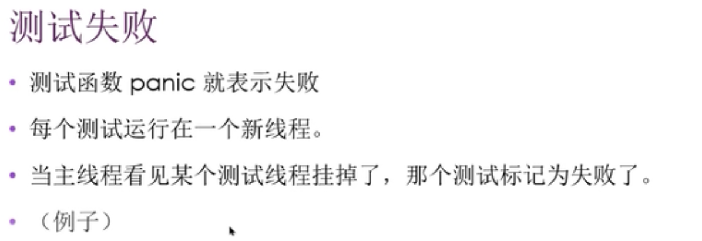

0050 测试（函数）

0100 解剖测试函数

测试函数首先就是个函数，只不过需要使用test属性进行标注。  
attribute只是对代码进行修饰，不会改变所修饰代码的逻辑

0220 运行测试

以上为cargo new adder --lib 生成的代码。  
这里就有test module 第二行。也有个test 函数 第四行。  
之所以是测试函数，是因为它上面个加了一个test attribute进行修饰。并不是因为它在一个test模块里，因为test模块里也可以有普通函数，也就是非测试函数。

0410 test结果的介绍，看视频。

0457 测试失败
  
例子：略。