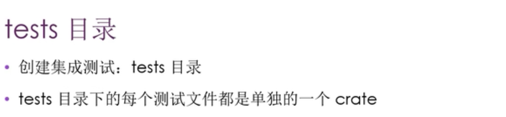
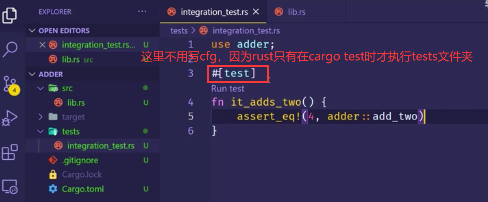
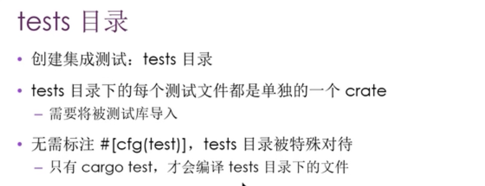
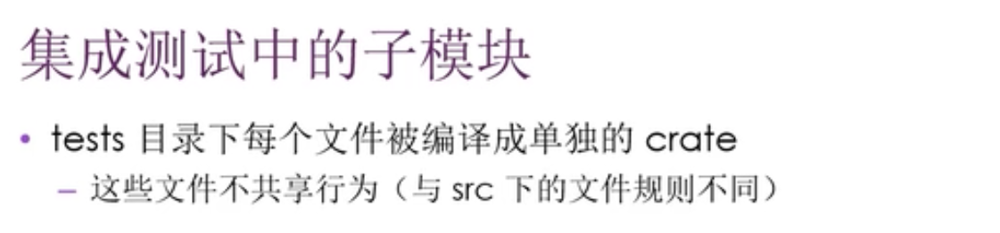
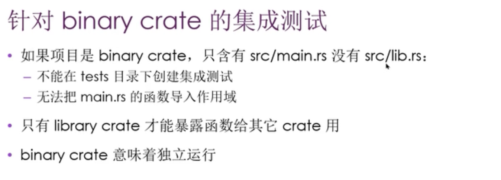

0034 集成测试

集成测试调用这个库的方式和其它代码调用这个库的方式是一样的。这就意味着它只能调用被测试库对外公开的那些api。

0100 tests 目录

0310 运行指定的集成测试

0431 集成测试中的子模块

？？？没太懂，以后理解

0713 针对binary crate的集成测试
  
0711 rust binary项目通常会把逻辑都放在lib.rs里。而main.rs里只有一些简单的调用，少量的胶水代码。因为这样做在集成测试的时候就可以把项目视为一个library crate。并可以通过使用use来访问这个项目的核心逻辑代码，只要这些逻辑代码没有问题，那核心功能估计也就没问题。？？？没太懂，以后理解