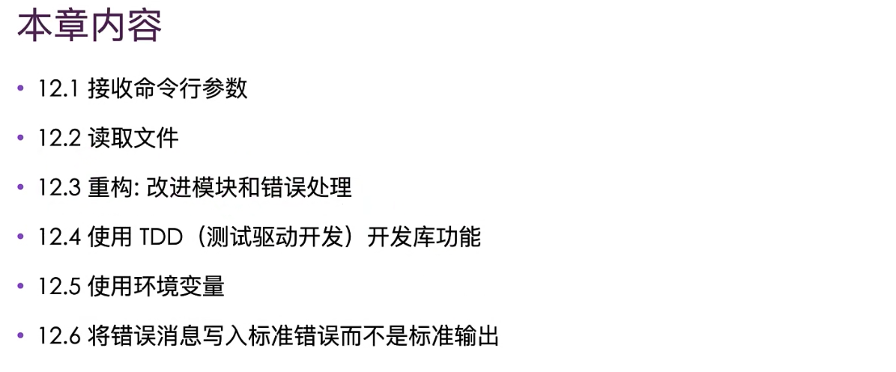
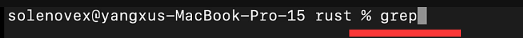
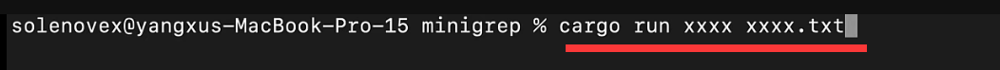
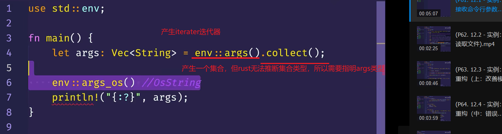
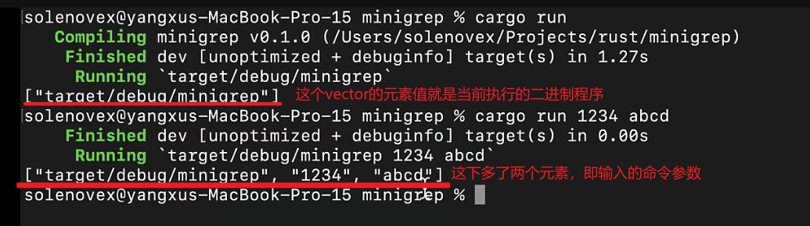
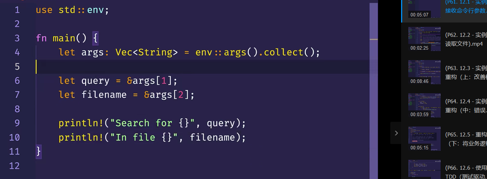
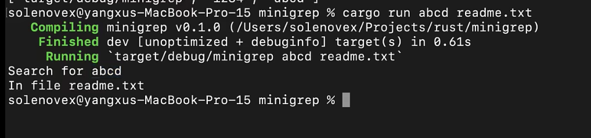

0000 本章内容

0100  
  
要实现的是一个grep工具。GREP全称是:Globally search a Regular Expression and Print。  
中文意思是全局搜索一个正则表达式并且输出，这里要做的就是一个简单的grep工具，在指定文件中搜索出指定的文字。  
所以这个grep工具需要接受一个文件名和一个字符串作为参数。执行时读取文件内容，搜索包含指定字符串的行，并最终将这些行打印输出。

以这样的形式运行。

0358

为了读取命令行参数，需要使用到一个函数。这个函数由rust标准库提供。agrs函数返回一个迭代器，目前只需要了解两个细节，首先这个迭代器会产生一些列的值。  
其次可以调用它的collect方法，把这一系列值转换成一个集合，比如vector。
完整是std::env::args()，但一般只调用到父模块，所以省略了后面。

首先获得的参数是二进制程序文件的名称，后面的元素是传给命令行真实的参数。  
根据需求，我们需要两个参数，所以把这两个参数放到变量里

