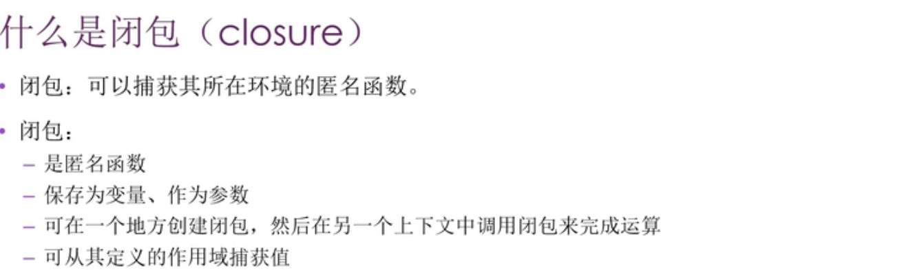

0000 本章内容

0035 rust语言设计时受到过很多语言的启发，函数式编程对rust影响就很大。这种风格特点有，把函数作为参数或把函数作为其它函数的返回值，或者把此函数赋给一个变量被以后执行。zzzz

0110 什么是闭包( closure)

0207

0215-0451  
这里是介绍普通方法处理所遇到的问题。内容较多，需看视频。zzzz

0451-end
这里介绍了引入闭包的操作。