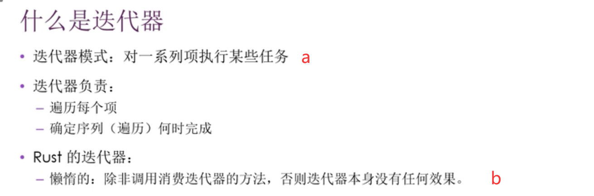
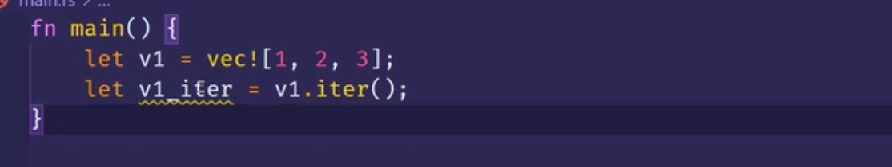
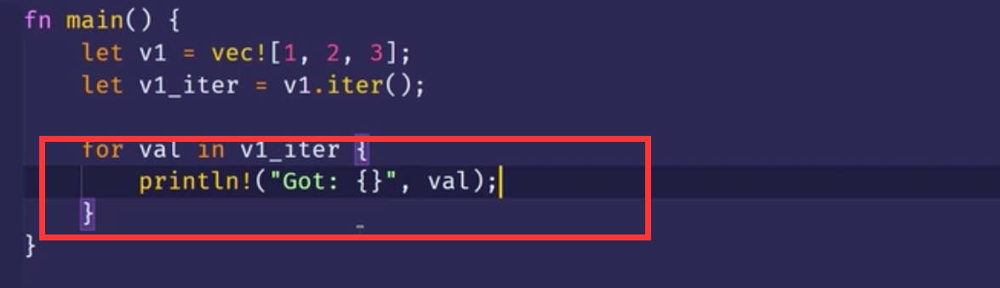
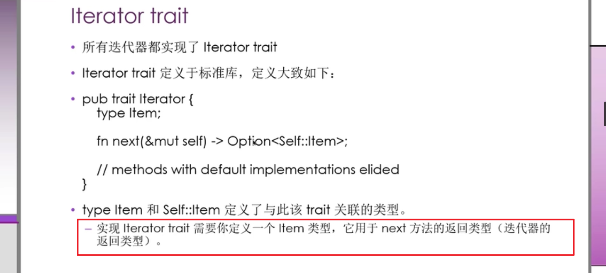
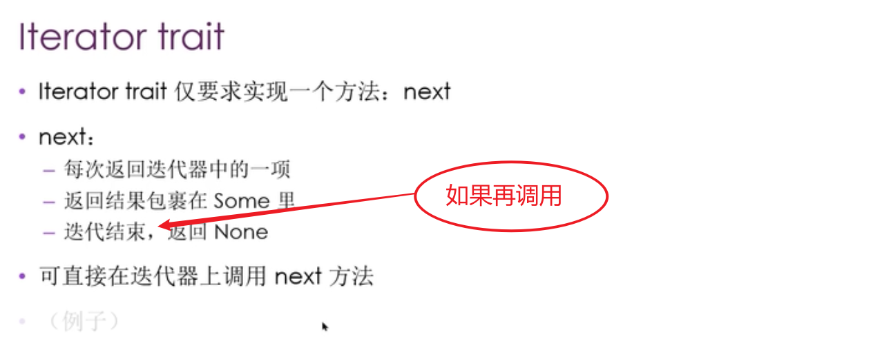
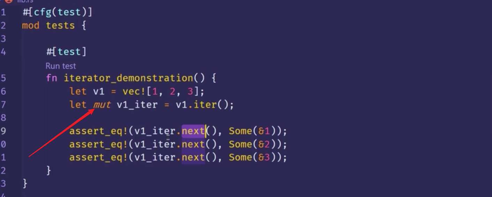
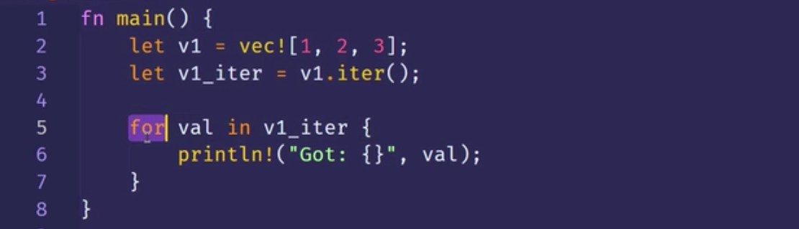

0047e  
a,迭代器模式：允许你依次为一些列项里的每个元素执行某些任务。  
b,这个迭代器你不用它时，就相当于什么事都没干。当你使用了某些可以消耗迭代器的方法后，这个时候才真正起作用。
***

v1_iter就是个迭代器，可以用于遍历v1这个vector。但目前还没使用。

最常见的用法，对迭代器进行遍历。
***

0142s 现在只需要知道最后这段话。
***

0251e

需要使用mut，因为调用next方法时，就相当于改变迭代器里面记录序列位置的状态。换句话说，每次调用就是消耗了迭代器里的一个元素。 zzzz

而之前这个for循环的例子就没加关键字，因为这个for循环实际上取得了v1_iter的所有权，并且在它部已经变成可变的了。 0347e。 cccc
***
之前用的iter方法生成的是不可变引用的迭代器。通过调用next方法取得的值实际上是指向vector中的元素的不可变引用。就是通过不可变引用来迭代元素的。        
而into_iter在迭代元素的时候会把元素移动到新的作用域内，并取得所有权。  
iter_mut方法，迭代（遍历）元素的时候使用的是一个可变的引用。 