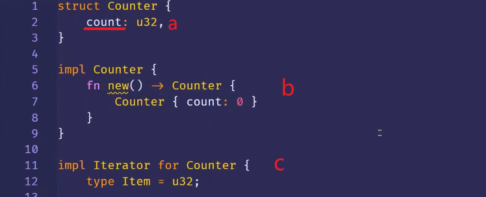
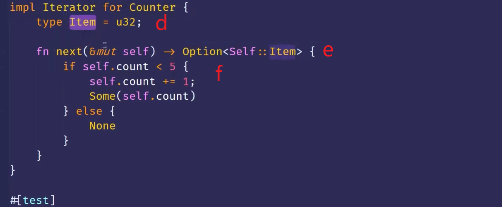
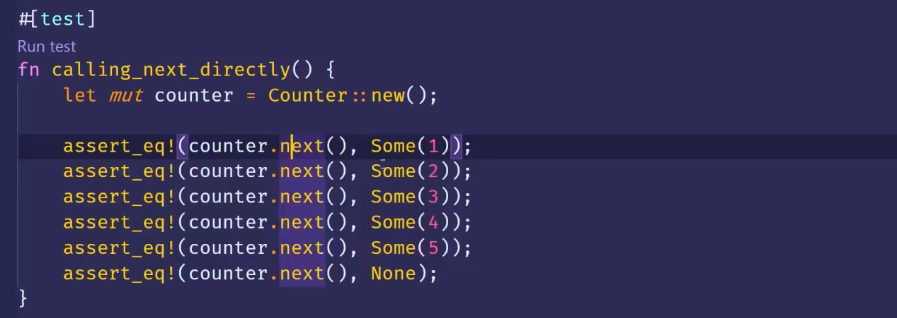
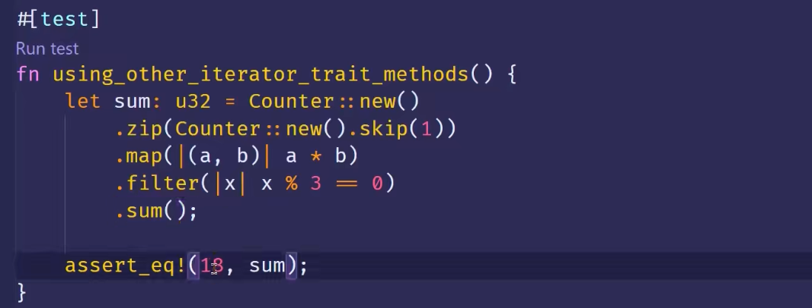

### 迭代器：使用 Iterator trait 创建自定义的迭代器

实际上只用一步，就是提供next方法的实现。
***

例子，做一个从1遍历到5的迭代器。  

zzzz  
a,count用来存储迭代过程中所需的数值，也就是迭代过程的状态。count字段是私有的，这样Counter这个结构体就能独立管理它的值了。    
b，然后做了一个关联函数，new函数，相当于是个构造函数。这样就能确保我们Counter（教程此时指的是第6行的Counter，dddd）实例里的count字段都是从0开始。  
c，接下来我们要实现这个自定义的迭代器就需要对Counter实现Iterator这个trait。前两节介绍过Iterator这个trait，他有两个关联类型，一个是type item，一个是next方法，主要是next方法。  
d，首先把type Item这个关联类型指定为u32，具体语法在第19章细讲，现在只需要知道这个迭代器会返回u32类型的数据。  
e，然后看下next方法，它的返回类型是option self::item，可以理解为就是option u32。  
f，这里就是普通的函数用法了，不做笔记。0125。所有做完后就拥有了一个自定义迭代器。测试过程就是调next方法
***

zzzz 这里有个更进阶的介绍，用到了zip，map，filter。直接看视频。 0250s